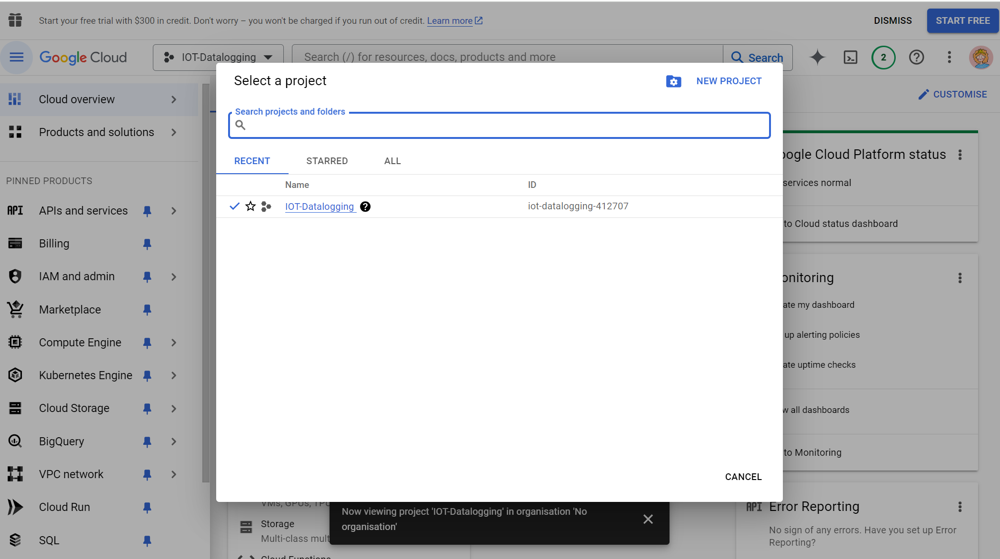
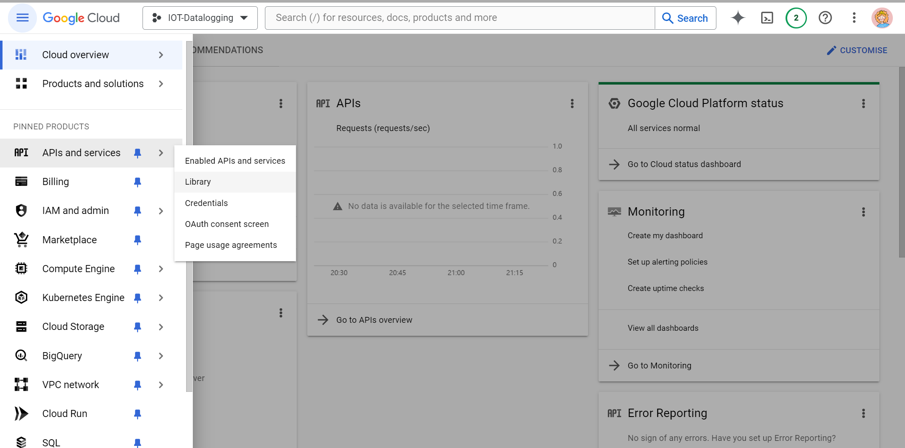
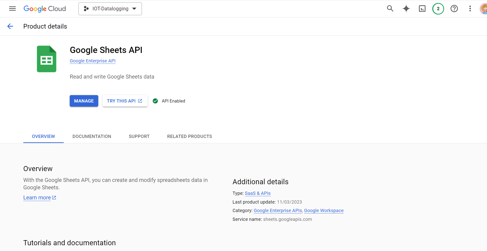
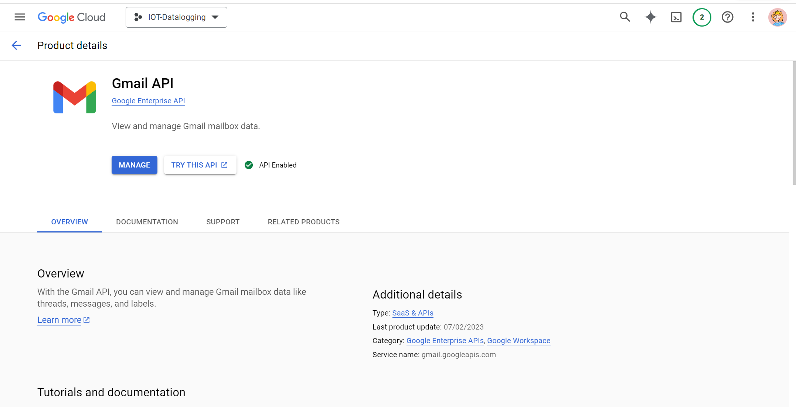
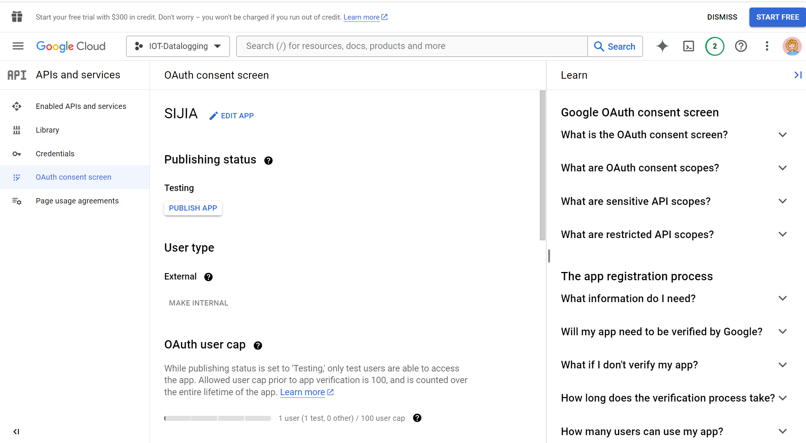
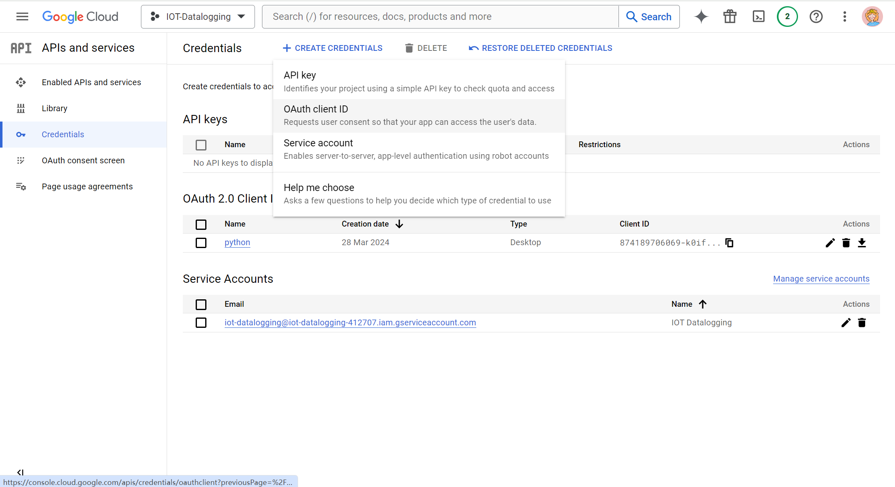

# How to Connect with Google API
1. create your project at https://console.cloud.google.com/

2. enable google sheet API: Navigation menu → APIs and services → Library (search google sheet API & Gmail API in library and enable it)

3. Navigation menu → APIs and services → OAuth consent screen(register the app)

4. Navigation menu → APIs and services → Credentials → CREATE CREDENTIALS(choose OAuth Client ID)

5. Download JSON

> you can find guidance on this video:
> https://www.youtube.com/watch?v=I5ili_1G0Vk